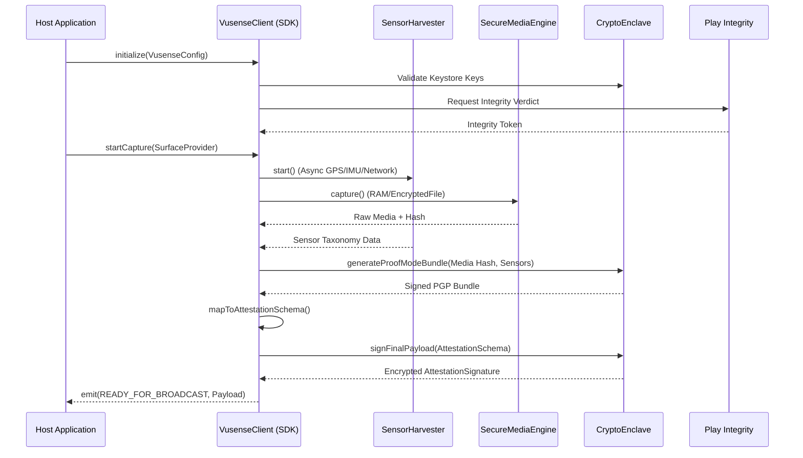

# Vusense Android SDK: Architecture & Implementation Plan

## 1. High-Level Objective
The Vusense Android SDK is a secure, zero-trust media capture and hardware attestation library. Its primary purpose is to capture media (photo/video), harvest high-fidelity device sensors (GPS, IMU, Network), wrap them into a signed ProofMode bundle, and validate device integrity, all while ensuring the resulting data cannot be tampered with or swapped locally.

---

## 2. Architectural Layers

### 2.1. The Public API Layer (`VusenseClient`)
The primary facade exposed to the host application. 
* **Design:** Headless SDK approach. The host application provides a UI (e.g., a `SurfaceProvider` for the camera preview) and handles permissions. The SDK handles the heavy lifting of security, capture, and data harvesting.
* **Input:** `VusenseConfig` containing the `vusense_context` (User ID, Policy ID) and application context.
* **Output:** A Kotlin `StateFlow` emitting progress states to the host, culminating in the final `AttestationSignature` payload ready for broadcast.

### 2.2. The Orchestration Layer (`AttestationOrchestrator`)
A strict state machine managing the synchronous and asynchronous tasks required for a valid capture.
* **States:** `INITIALIZING` -> `CHECKING_INTEGRITY` -> `HARVESTING_SENSORS` -> `CAPTURING_MEDIA` -> `SIGNING_PAYLOAD` -> `READY_FOR_BROADCAST`.
* If any step fails (e.g., device is rooted, GPS timeout), the orchestrator aborts and emits a `FAILED` state.

### 2.3. The Core Engines
* **`CryptoEnclave`:** Interfaces with the Android Hardware-Backed Keystore. Generates hardware-bound asymmetric keys on the first run, signs the ProofMode bundle, and signs the final payload wrapper. No keys are ever generated in software.
* **`SecureMediaEngine`:** Wraps the `CameraX` API. Buffers frames into volatile RAM or the `androidx.security.crypto.EncryptedFile` wrapper. Strict ban on writing raw un-hashed media to the public `MediaStore`.
* **`SensorHarvester`:** Uses Kotlin Coroutines (`suspend` functions and Flows) to gather data from `LocationManager` (GPS bounds), `SensorManager` (IMU), and `TelephonyManager` (Cell towers/WiFi BSSIDs) concurrently with media capture.

### 2.4. The Payload Builder
Maps the raw ProofMode bundle, the media hash, and the Play Integrity token directly into the strict `attestation_schema.json` format defined by the `shared-protocol` submodule.

---

## 3. Data & Attestation Flow

---

## 4. Security Boundaries & Constraints
* **`minSdk 26` (Android 8.0):** Guarantees baseline Keymaster/StrongBox support.
* **No PII Logging:** Strict rule against printing cryptographic keys, GPS, or PGP bundles to Logcat.
* **No `MediaStore` Swap Attacks:** Capture happens directly in the app sandbox.
